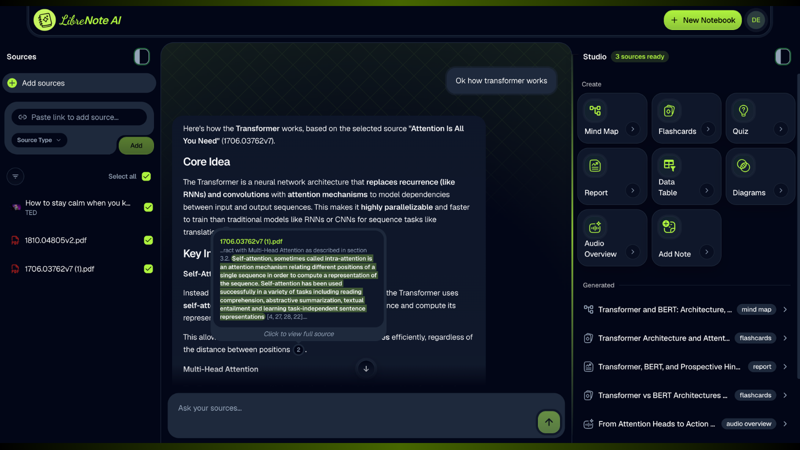

<p align="center">
  
</p>

<h1 align="center">LibreNote AI</h1>

<p align="center">
  <a href="LICENSE"></a>
  <a href="https://bun.sh"></a>
  <a href="https://nextjs.org"></a>
</p>
<p align="center"><strong>The open-source, self-hosted alternative to NotebookLM.</strong></p>
<p align="center">
  
</p>

<p align="center">
  Upload your sources, chat with grounded citations, and generate studio artifacts — flashcards, quizzes, mind maps, diagrams, audio overviews, and more — fully on your machine or server.
</p>

<p align="center">
  <strong>Technical setup, commands, and deployment</strong> → <a href="docs/README.md">Documentation</a>
  · <a href="docs/CASE_STUDY.md">Case study</a>
</p>

---

## Why LibreNote AI?

If you like the *idea* of NotebookLM but want ownership of your data, choice of AI models, and the freedom to self-host — LibreNote AI is built for that.

| | NotebookLM (Gemini) | LibreNote AI |
|---|---------------------|--------------|
| **Hosting** | Google-hosted | Self-hosted — your machine or your server |
| **Data privacy** | Processed in Google's cloud | Your Postgres, your Supabase, your API keys |
| **AI models** | Google Gemini only | Any model on [OpenRouter](https://openrouter.ai) (Claude, GPT, Gemini, Llama, …) |
| **Audio overviews** | Google-hosted, usage limits apply | Podcast-style audio you generate on your stack |
| **Studio artifacts** | Limited set, closed product | 8 types: mind maps, flashcards, quizzes, reports, data tables, diagrams, audio, notes |
| **Open source** | Closed | MIT — inspect, fork, extend |
| **Multi-user** | Tied to Google account | Self-hosted auth with per-user data isolation |
| **Setup** | Sign in with Google | One command: `bun run setup` |

---

## What you can do

### Add sources
Bring in the material you already work with:

- **Documents** — PDF, Word, spreadsheets, plain text, Markdown
- **Web** — paste a URL or import links in bulk
- **YouTube** — transcripts from video links
- **Audio** — mp3, wav, m4a, and more
- **Notes** — paste text directly

### Chat with your sources
Ask questions and get answers **grounded in your uploads**, with inline citations that jump back to the exact passage.

### Studio — turn research into outputs
| Artifact | What it's for |
|----------|----------------|
| **Mind map** | Visual map of concepts and connections |
| **Flashcards** | Study cards from your material |
| **Quiz** | Test yourself on what you read |
| **Report** | Structured write-up with charts |
| **Data table** | Comparisons, timelines, metrics |
| **Diagrams** | Mermaid flowcharts, sequence, ER, Gantt, and 20+ diagram types |
| **Audio overview** | Podcast-style summary you can listen to |
| **Note** | Rich notes pinned to your notebook |

### Keep control
- Sources, embeddings, and chat history live in **your** database
- File uploads go to **your** storage
- No vendor lock-in on which AI model you use

---

## Get started

You need two things installed: **[Docker Desktop](https://docs.docker.com/get-docker/)** (running) and **[Bun](https://bun.sh)**.

```bash
git clone https://github.com/devyanshyadav/librenote-ai.git
cd librenote-ai
bun run setup
```

Setup installs everything, starts the local database, builds the app, and opens **http://localhost:3000**. Sign up with email and password — you're in.

<details>
<summary><strong>Do I need to be a developer?</strong></summary>

Not deeply. If you can install Docker and Bun and paste commands into a terminal, the one-command setup handles the rest. For step-by-step instructions, env variables, cloud hosting, and troubleshooting, use the **[full documentation](docs/README.md)**.

</details>

<details>
<summary><strong>Do I need an OpenRouter API key right away?</strong></summary>

No. Setup works without it. Add `OPENROUTER_API_KEY` to `.env.local` when you want chat, embeddings, and studio features. The app reminds you in the header until you add one. Keys are created at [openrouter.ai/keys](https://openrouter.ai/keys).

</details>

<details>
<summary><strong>Can I use cloud hosting instead of my laptop?</strong></summary>

Yes. Run LibreNote AI on a VPS or your own server with a [cloud Supabase](https://supabase.com) project instead of local Docker. See **[Cloud Supabase setup](docs/README.md#cloud-supabase)** in the docs.

</details>

<details>
<summary><strong>How is this different from just using ChatGPT with uploads?</strong></summary>

LibreNote AI is built around **notebooks and sources** — not one-off chats. Your files are chunked, embedded, and searched with citations. Studio turns the same sources into study and presentation artifacts. Everything persists in your own database, organized by notebook.

</details>

---

## Privacy at a glance

| What | Where it lives |
|------|----------------|
| Uploaded files | Your Supabase Storage |
| Text & embeddings | Your Postgres database |
| API keys | Your `.env.local` file (never committed to git) |
| Other users' data | Isolated — each account only sees their own notebooks |

---

## Tech stack (summary)

Next.js · Supabase · PostgreSQL + pgvector · Drizzle · OpenRouter

Full architecture, scripts, and configuration → **[Documentation](docs/README.md)**

---

## Author

Built by **[Devyansh Yadav](https://www.devyanshyadav.com/)**

- [GitHub](https://github.com/devyanshyadav)
- [X](https://x.com/DevyanshYadavv)
- [LinkedIn](https://www.linkedin.com/in/devyansh-yadav/)
- [hello@devyanshyadav.com](mailto:hello@devyanshyadav.com)

---

## License

[MIT](LICENSE) — use, modify, and deploy freely.

*NotebookLM and Google Gemini are trademarks of Google LLC. LibreNote AI is an independent open-source project and is not affiliated with or endorsed by Google.*
