# Building LibreNote AI — A Case Study

How I built an open-source, self-hosted alternative to NotebookLM — from document ingestion to grounded chat and AI-generated study artifacts.

**Repo:** [github.com/devyanshyadav/librenote-ai](https://github.com/devyanshyadav/librenote-ai)

---

## Table of contents

1. [The problem](#1-the-problem)
2. [The goal](#2-the-goal)
3. [High-level architecture](#3-high-level-architecture)
4. [Tech stack](#4-tech-stack)
5. [End-to-end flow](#5-end-to-end-flow)
6. [Ingestion pipeline](#6-ingestion-pipeline)
7. [Search & retrieval (RAG)](#7-search--retrieval-rag)
8. [Grounded chat & citations](#8-grounded-chat--citations)
9. [Source digests & notebook brief](#9-source-digests--notebook-brief)
10. [Studio artifact engine](#10-studio-artifact-engine)
11. [User interface](#11-user-interface)
12. [Reliability & error handling](#12-reliability--error-handling)
13. [Key numbers](#13-key-numbers)
14. [Tradeoffs & lessons](#14-tradeoffs--lessons)
15. [What’s next](#15-whats-next)

---

## 1. The problem

NotebookLM is a great product, but it comes with limits:

- Your data lives in Google’s cloud
- You’re locked to Google’s models
- You can’t inspect, fork, or extend the product
- Audio and studio features are tied to Google’s stack

I wanted a **NotebookLM-style experience** that I fully own: my database, my API keys, my server.

---

## 2. The goal

Build **LibreNote AI** — an open-source app where you can:

1. **Add sources** — PDFs, Word docs, web pages, YouTube, audio, and more
2. **Chat with citations** — answers grounded in your sources, with clickable references
3. **Generate studio artifacts** — mind maps, flashcards, quizzes, reports, data tables, audio overviews, and notes

**Core principles:**

- Self-hosted (your Postgres, your Supabase, your OpenRouter key)
- One-command local setup (`bun run setup`)
- Model-agnostic via OpenRouter
- Simple architecture — no separate vector database or job queue unless needed

---

## 3. High-level architecture

LibreNote AI has four connected stages. Data flows in one direction: **sources become chunks**, **chunks power chat**, and **digests power Studio**.

<p align="center">
  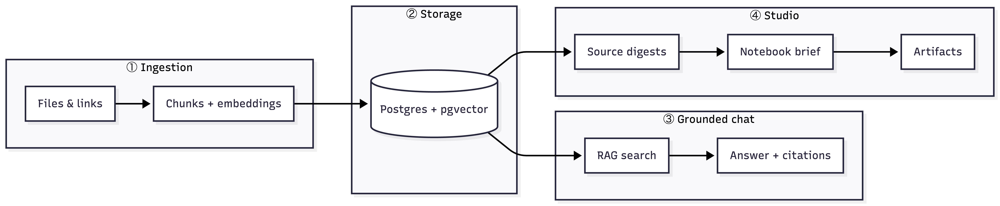
</p>

| System | What it does |
|--------|----------------|
| **Ingestion** | Parse files, chunk text, embed vectors, store in Postgres |
| **RAG + Chat** | Find the right chunks and answer with verifiable citations |
| **Studio** | Compress the notebook into a brief, then generate structured outputs |

Everything runs in one **Next.js app**. Supabase handles auth and file storage. OpenRouter handles all AI models.

---

## 4. Tech stack

| Layer | Choice |
|-------|--------|
| Framework | Next.js 16.3 (App Router) |
| Database | PostgreSQL + pgvector (via Supabase) |
| ORM | Drizzle |
| Auth & storage | Supabase |
| AI | Vercel AI SDK + OpenRouter |
| Client state | TanStack Query + Zustand |
| UI | React, Tailwind, shadcn |

---

## 5. End-to-end flow

One journey from upload to artifact:

<p align="center">
  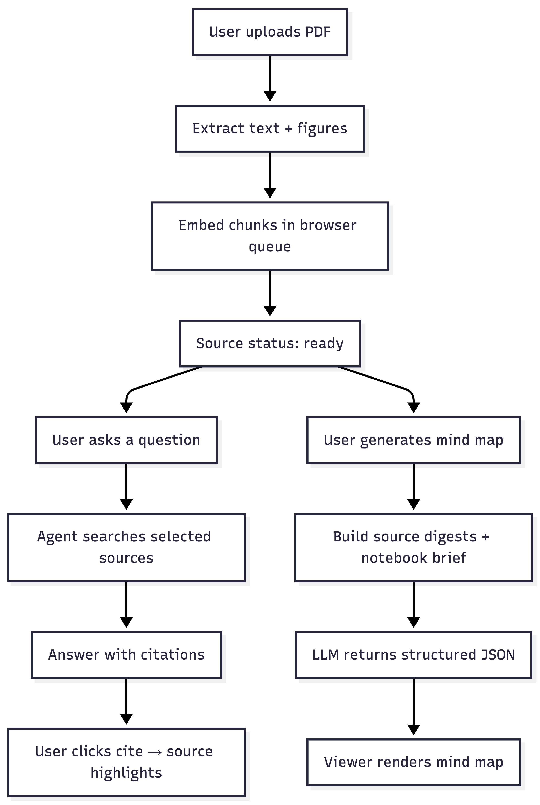
</p>

---

## 6. Ingestion pipeline

### The core idea

Before a user can chat with a document, the app must answer one question: **how do we turn a PDF, Word file, or YouTube link into searchable pieces the AI can find later?**

The answer is a pipeline with three outputs:

1. **Text chunks** — small, overlapping passages stored in Postgres
2. **Embeddings** — 1,024-dimensional vectors (one per chunk) for semantic search
3. **Figure metadata** — images from PDFs/Word docs, linked to their chunks

### Supported sources

| Input | How it’s processed |
|-------|-------------------|
| PDF, Word, spreadsheet | Structured parsers extract text + figures |
| Web URL | Readability extracts main article text |
| YouTube | Transcript API (captions, not speech-to-text on video) |
| Audio upload | Voxtral transcription via OpenRouter |
| Pasted text | Stored directly |

### Why two phases?

Embedding a large PDF can take **minutes** and thousands of API calls. A single server request would hit timeouts on serverless hosting.

So ingestion is split:

- **Phase 1 (server)** — parse fast, save structure, return quickly
- **Phase 2 (browser)** — embed in small batches, resumable if the tab closes

<p align="center">
  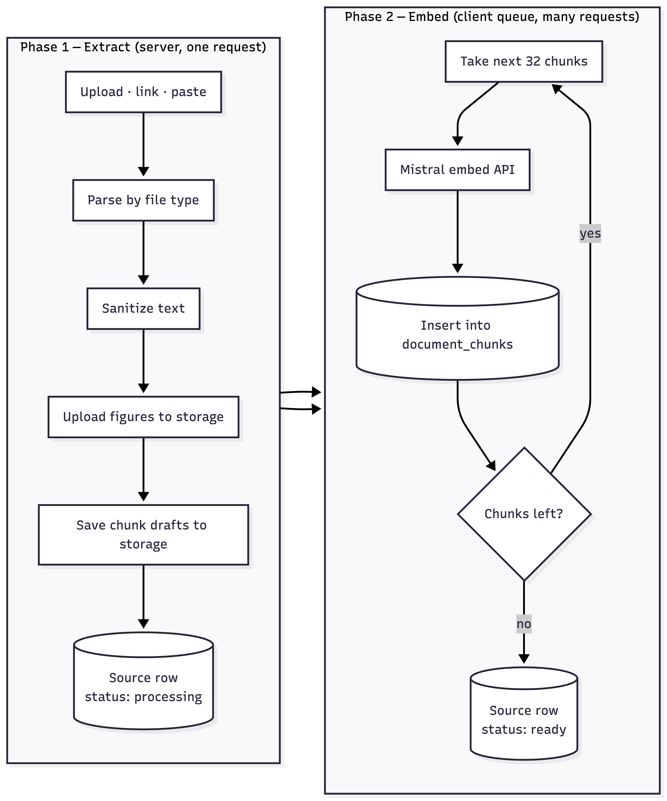
</p>

**What happens in each phase:**

| Phase | Who runs it | What it does |
|-------|-------------|--------------|
| **Extract** | Server | Parse file, create source row, upload images, write chunk drafts |
| **Embed** | Browser | Call `/api/sources/[id]/embed` repeatedly until `done: true` |

If the user refreshes mid-embed, the app resumes from `embeddedChunkCount` — no work is lost.

### From raw file to chunks

<p align="center">
  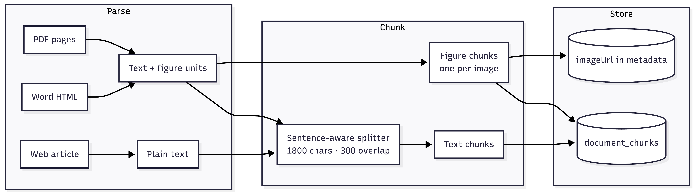
</p>

**Chunking rules:**

- Text is split on **sentence boundaries** when possible (avoids cutting mid-sentence)
- Each chunk is at most **1,800 characters**, with **300 characters overlap** between neighbors (so context isn’t lost at boundaries)
- **Figures are never split** — each image becomes its own chunk with caption + page context

### How figures are preserved

Figures are a common failure point in RAG systems — many pipelines strip images and lose chart/diagram context.

LibreNote keeps them in three steps:

<p align="center">
  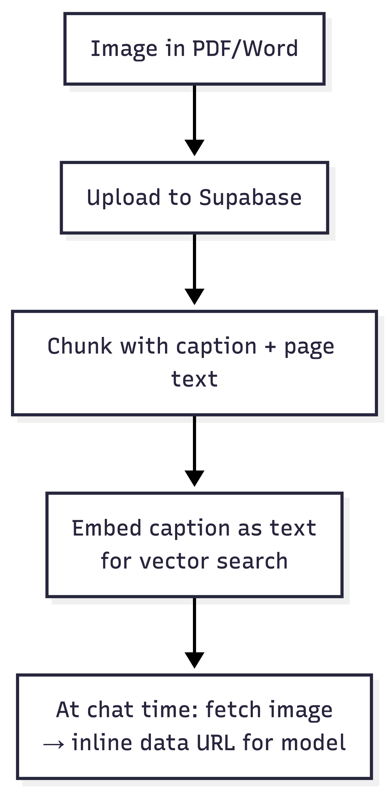
</p>

- **PDF:** extract embedded images per page; attach up to 800 chars of page text as context
- **Word:** mammoth emits `figure://N` placeholders during HTML parsing; images are uploaded and replaced with storage URLs
- **At search time:** the chunk text is retrieved by vector search; the actual image is fetched and sent to the model separately (as a data URL, so localhost URLs work)

### Large documents

If extracted text exceeds **50,000 characters**, the full text is not kept on the `sources` row — only chunks in the database. Summaries and Studio read from chunks when needed. This keeps the database lean for big corpora.

### Ingest status

| Status | Meaning |
|--------|---------|
| `processing` | Extraction done or embedding in progress |
| `ready` | All chunks embedded — searchable in chat |
| `failed` | Embed error — user can retry |

Only `ready` sources appear in search and Studio generation.

---

## 7. Search & retrieval (RAG)

### The core idea

When a user asks *“How do transformers work?”*, the model cannot read every page of every PDF in the notebook. **RAG (Retrieval-Augmented Generation)** solves this:

1. **Find** the most relevant passages from the user’s selected sources
2. **Pack** them into the model’s context window
3. **Answer** using only that evidence

LibreNote’s RAG is not a separate microservice — it’s a **tool** the chat agent calls (`searchContext`) before answering.

### The full RAG pipeline

Think of retrieval as a funnel: many candidates go in, a small, high-quality context comes out.

<p align="center">
  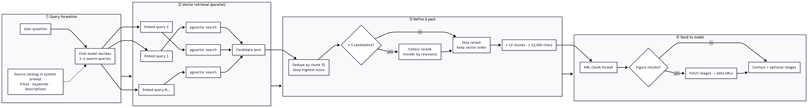
</p>

### Step-by-step explanation

#### Step 1 — The model writes search queries (not a separate service)

The chat agent does **not** search with the user’s exact words. It calls `searchContext` with **1–4 keyword-rich queries** — different angles on the same question.

Example — user asks: *“Compare BERT and the original Transformer”*

The model might search:

1. `BERT architecture encoder layers`
2. `Transformer attention mechanism original paper`
3. `BERT vs Transformer differences`

A **source catalog** in the system prompt helps here. Each selected source lists its title, type, description, and extracted keywords — so the model knows what vocabulary exists in the notebook.

#### Step 2 — Parallel vector search

Each query is embedded with **Mistral Embed** (1,024 dimensions), then searched against `document_chunks` in Postgres using **pgvector** (cosine similarity).

| Filter | Value |
|--------|-------|
| Scope | Only **selected** sources with status `ready` |
| Similarity threshold | **> 0.35** (filters weak matches) |
| Results per query | **Top 20** |

All queries run **in parallel** (`Promise.all`), so multi-query search doesn’t multiply latency.

#### Step 3 — Dedupe

The same chunk can match multiple queries. The app merges results by chunk ID and **keeps the highest similarity score**.

If the agent calls `searchContext` multiple times in one turn, chunks from earlier calls are also accumulated (no duplicates).

#### Step 4 — Conditional reranking

Vector search is fast but imprecise — it finds *semantically similar* text, not always the *most relevant* text.

When there are **5 or more** unique candidates, the app sends them to **Cohere Rerank** (via OpenRouter) to reorder by true relevance to the combined query.

| Candidates | Action |
|------------|--------|
| **< 5** | Skip rerank — save latency and API cost; vector order is good enough |
| **≥ 5** | Rerank all candidates; replace similarity with rerank score |

If reranking fails or times out (15s), the app **falls back to vector order** — search never hard-fails.

#### Step 5 — Context packing

Reranked chunks are walked in order until limits are hit:

- Max **12 chunks**
- Max **12,000 characters** total

At least one chunk is always included (even if it alone exceeds the char limit).

#### Step 6 — Format for the model

Selected chunks are wrapped in XML so the model can cite them by index:

```xml
<chunk index="1" source="Attention Is All You Need">
The Transformer architecture relies entirely on self-attention...
</chunk>

<chunk index="2" source="BERT paper" kind="figure" page="3">
Figure 1: BERT input representation...
</chunk>
```

**Figure chunks** also trigger image inlining: the app fetches each `imageUrl`, converts it to a base64 data URL, and attaches it as a file part. This fixes models that reject `http://localhost` image URLs.

### RAG in the chat loop

RAG is not a one-shot lookup. The agent can search, read results, search again, then answer.

<p align="center">
  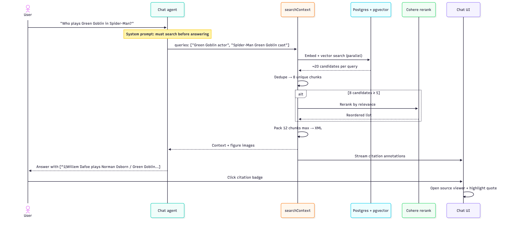
</p>

### Why these design choices?

| Decision | Reason |
|----------|--------|
| **LLM writes queries** | No extra query-expansion service; the catalog gives enough context |
| **Multi-query (up to 4)** | One phrasing often misses relevant passages; multiple angles improve recall |
| **Pure vector search** | Simpler ops — one Postgres DB, no Elasticsearch; good enough for v1 |
| **Conditional rerank** | Reranking helps when the candidate pool is noisy; unnecessary when it’s small |
| **Selected sources only** | User controls scope — avoids searching sources they didn’t intend |
| **XML chunk format** | Stable indices for sentence-level citations |
| **Inline figure images** | Multimodal models can see charts, not just captions |

### What RAG does not do (yet)

- No keyword/BM25 hybrid search
- No query embedding cache (each search embeds fresh)
- No diversity/MMR re-ranking beyond Cohere
- No minimum rerank score cutoff (all reranked chunks can enter context)

---

## 8. Grounded chat & citations

RAG finds the evidence. **Grounded chat** makes the model use it honestly — and gives the user a way to verify every claim.

### How chat and RAG connect

<p align="center">
  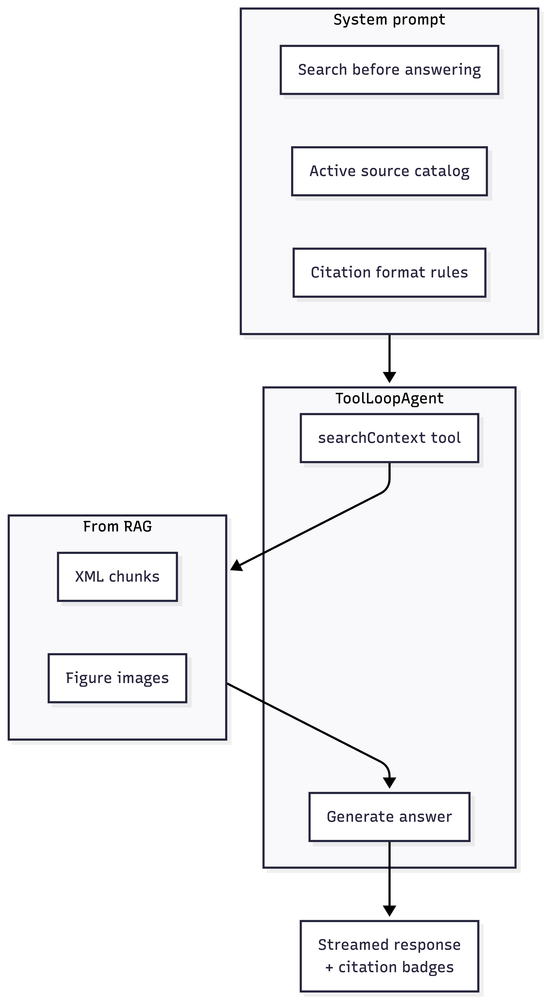
</p>

### Agent rules

- **ToolLoopAgent** with one tool: `searchContext`
- Must call search before answering any document question
- Can retry with a **new query set** if results are thin
- Max **5 agent steps** per turn (search → search again → answer, etc.)

### Citation format

The model cites **individual sentences**, not whole paragraphs:

```text
Transformers use self-attention. [^3|The Transformer model relies...on self-attention]
```

| Part | Meaning |
|------|---------|
| `3` | Chunk index from the search results |
| `start...end` | Short phrase copied from the chunk (used for highlighting) |

### Citation journey (UI)

<p align="center">
  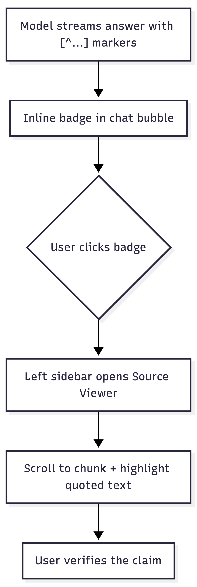
</p>

Citation metadata is streamed as **annotations** during the response and stored in client state. Before the next API call, annotations are **stripped** from chat history so the model isn’t confused by old citation data.

### Source selection

| UI element | What it shows |
|------------|---------------|
| **Sidebar checkboxes** | Which sources are included in search |
| **Studio badge** | “N sources ready” |
| **Chat search indicator** | Source icons while the agent is searching |

Only sources with status `ready` are searchable.

---

## 9. Source digests & notebook brief

Chat RAG works on **chunks**. Studio needs a **notebook-level summary** — something that fits in one prompt even when sources are hundreds of pages.

### The problem

Passing full documents to the Studio LLM would:

- Exceed token limits
- Cost too much
- Dilute focus across unrelated passages

### The solution — two tiers

<p align="center">
  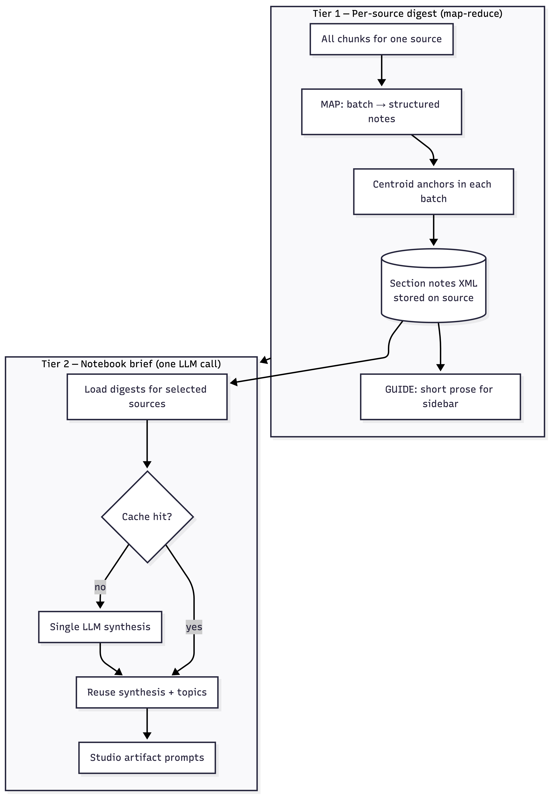
</p>

### Tier 1 — Per-source digest

**MAP:** Chunks are batched (~10 per batch). Each batch gets one LLM call that returns structured notes: main topics, key points, conclusions.

**Centroid anchors:** Before each map call, the app finds the 2 chunks **closest to the global embedding centroid** and adds them as “representative excerpts” in the prompt. This keeps the most central content visible — it is **not** k-means clustering, just anchor selection.

**STORE:** All batch notes are saved as XML section notes. These are never merged away — Studio always reads the full notes.

**GUIDE:** A shorter prose summary for the sidebar “source guide” UI. For very large docs, sections may be pairwise-merged only for this guide.

### Tier 2 — Notebook brief

When generating any Studio artifact:

1. Load section notes for all **selected** sources (`ensureSourceDigest` — cached per source)
2. Check notebook cache (fingerprint = source IDs + note lengths)
3. On cache miss: **one** LLM call produces `{ synthesis, topics }`
4. Cache on the notebook row

`buildBriefContext()` injects synthesis, topics, and per-source notes into every artifact prompt.

---

## 10. Studio artifact engine

### Registry pattern

Each artifact type (mind map, quiz, flashcards, etc.) is defined in one config:

- Zod schema (what the LLM must return)
- System and user prompts
- Icon and title
- Optional generation options (e.g. quiz length, audio style)

Adding a new artifact type = schema + prompts + viewer component.

### Generation flow

<p align="center">
  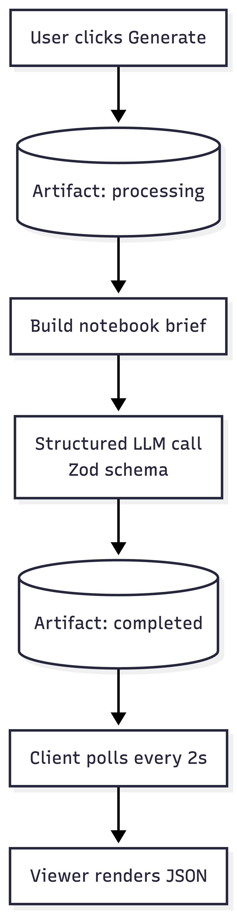
</p>

### Artifact types shipped

| Type | Output |
|------|--------|
| Mind map | Tree of nodes + edges (React Flow viewer) |
| Flashcards | Front/back cards with SRS-style study mode |
| Quiz | Multiple choice with explanations |
| Report | Sections (takeaways, text, charts) |
| Data table | Columns + rows |
| Audio overview | Script → TTS → WAV file |
| Note | Manual rich-text note |

### Audio overview (two steps)

1. **Script** — LLM generates lines (narrator or podcast with hosts)
2. **TTS** — Kokoro model synthesizes speech, assembles tracks, uploads WAV to storage

The player syncs word highlighting to playback using a generated timeline.

### Job lifecycle

| Status | Meaning |
|--------|---------|
| `processing` | Generation in progress |
| `completed` | Content saved |
| `failed` | Error during generation |
| `timeout` | Ran longer than 5 minutes |

There is no separate job queue — work runs via `after()` in the API route (max 5 minutes server time).

---

## 11. User interface

### Three-pane layout

```text
┌──────────────┬────────────────────┬──────────────┐
│   Sources    │       Chat         │    Studio    │
│  (left)      │     (center)       │   (right)    │
└──────────────┴────────────────────┴──────────────┘
```

- Left and right sidebars are **resizable** and **cookie-persisted**
- Opening a citation swaps the left panel to the source viewer
- Selecting an artifact swaps the right panel to the artifact viewer

### Notable viewers

**Mind map** — LLM outputs a tree; Dagre computes layout; React Flow renders it. Branches can collapse/expand. “Ask about this branch” sends a prompt to chat.

**Flashcards & quiz** — Study modes with keyboard shortcuts, source filters, and “view source” / “ask in chat” actions.

**Report** — Table of contents with scroll-spy; print mode via `?print=1`.

**Audio overview** — Word-level karaoke highlighting synced to playback.

### Add sources

A modal supports: single link, drag-and-drop files, bulk URLs, paste text, and audio upload. Link type is detected automatically (web, YouTube, PDF).

---

## 12. Reliability & error handling

AI systems fail often. The app layers several defenses:

| Layer | What it does |
|-------|----------------|
| **Model fallback** | Primary model fails (rate limit, overload) → try backup model |
| **API retries** | Transient network errors retried within one call |
| **Schema retries** | If JSON doesn’t match schema → up to 3 full regeneration attempts |
| **JSON repair** | Try to fix malformed JSON before giving up |
| **Artifact timeout** | After 5 minutes, mark as `timeout` and stop polling |
| **Embed resume** | Ingest can continue from last embedded chunk after refresh |

Failed artifacts are not auto-retried — the user can regenerate manually.

---

## 13. Key numbers

Quick reference for the main constants:

| Setting | Value |
|---------|-------|
| Chunk size | 1,800 chars |
| Chunk overlap | 300 chars |
| Embedding dimensions | 1,024 |
| Similarity threshold | 0.35 |
| Candidates per query | 20 |
| Max search queries per call | 4 |
| Rerank when candidates ≥ | 5 |
| Max context chunks | 12 |
| Max context chars | 12,000 |
| Agent max steps | 5 |
| Artifact timeout | 5 min |
| Schema retry attempts | 3 |

---

## 14. Tradeoffs & lessons

### What worked well

- **One Postgres database** for everything (no separate vector DB)
- **Client-side embed queue** — simple and resumable
- **Registry-driven Studio** — easy to add new artifact types
- **Sentence-level citations** — users can verify every claim
- **OpenRouter** — swap models without rewriting the app

### What I’d do differently

| Area | Current | Possible improvement |
|------|---------|---------------------|
| Search | Vector only | Add BM25 + hybrid ranking |
| Jobs | `after()` in API route | Durable queue (Inngest, Bull) for long runs |
| Collaboration | Schema exists, no UI | Ship sharing or remove unused tables |
| Tests | Manual only | Golden sets for RAG quality |
| Deploy | Manual VPS + Supabase | Dockerfile + CI/CD |

### Honest gaps

- No billing or usage metering (BYOK only)
- Email/password auth only (no Google/GitHub OAuth yet)
- Three artifact types exist in the DB enum but are not in the UI yet (slide deck, video overview, infographic)
- No automated test suite

---

## 15. What’s next

Possible directions:

- Hybrid search (keyword + vector)
- OAuth providers
- Collaboration and sharing
- More artifact types
- Docker image for easier deployment
- RAG evaluation benchmarks

---

## Summary

LibreNote AI is a full-stack research notebook: **ingest → embed → search → cite → synthesize**. The architecture favors simplicity (one app, one database, OpenRouter for models) while handling real-world problems like large files, figure images, schema mismatches, and long-running generations.

The hardest parts were not the LLM calls — they were **resumable ingestion**, **trustworthy citations**, and **compressing large notebooks** into something Studio can use without losing the core ideas.

---

*For setup and deployment, see [docs/README.md](./README.md). For the product overview, see the [main README](../README.md).*
