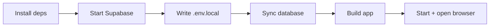

# LibreNote AI — Documentation

Technical reference for installing, configuring, and running LibreNote AI.

**New here?** Start with the [project README](../README.md) for a plain-language overview.

---

## Table of contents

- [Prerequisites](#prerequisites)
- [Local setup](#local-setup)
- [What setup does](#what-setup-does)
- [Development vs production](#development-vs-production)
- [Commands](#commands)
- [Local services](#local-services)
- [Environment variables](#environment-variables)
- [Cloud Supabase](#cloud-supabase)
- [Tech stack](#tech-stack)
- [Security & privacy](#security--privacy)
- [Troubleshooting](#troubleshooting)

---

## Prerequisites

| Requirement | Notes |
|-------------|--------|
| [Docker Desktop](https://docs.docker.com/get-docker/) | Must be **running** before setup |
| [Bun](https://bun.sh) | Package manager and runtime |
| Supabase CLI | Included as a dev dependency — no separate install |

Works on **macOS, Linux, and Windows** (Docker Desktop + Bun).

---

## Local setup

```bash
git clone https://github.com/devyanshyadav/librenote-ai.git
cd librenote-ai
bun run setup
```

This single command:

1. Installs dependencies (`bun install`)
2. Starts local Supabase (`project_id: librenoteai`)
3. Writes `.env.local` (preserves existing keys like `OPENROUTER_API_KEY`)
4. Syncs the database (pgvector, seed, Drizzle schema push)
5. Builds the app and starts it in **production mode**
6. Opens [http://localhost:3000](http://localhost:3000)

Create an account with **email and password**, then open your first notebook.

### Local auth behavior

- Email confirmation is **disabled** locally — sign-up signs you in immediately.
- Password reset emails go to the local inbox at [http://127.0.0.1:54324](http://127.0.0.1:54324) (Mailpit), not your real email.

---

## What setup does



| Step | Action |
|------|--------|
| Dependencies | `bun install` |
| Infrastructure | Docker check → `supabase start` (skips if already running) |
| Environment | Updates `.env.local` managed keys |
| Database | `CREATE EXTENSION vector` → `supabase/seed.sql` → `drizzle-kit push --force` |
| Build & launch | `bun run build` → `bun start` → poll port 3000 → open browser |

**Ports used:** `54320–54324` for this project's Supabase stack only. Setup does not stop unrelated Docker containers, but will reclaim those ports from other **local Supabase stacks** if needed.

### Setup flags

| Flag | Effect |
|------|--------|
| `--no-dev` / `--no-start` | Finish setup without building or starting the app |
| `--skip-supabase` | Database-only mode (used by `setup:db`) |

```bash
bun run setup --no-dev    # setup only, then run bun dev yourself
bun run setup:db          # same as setup --skip-supabase
```

---

## Development vs production

| Mode | When to use | Command |
|------|-------------|---------|
| **Production** (default after setup) | First install, testing prod build | `bun run setup` |
| **Development** | Day-to-day coding, hot reload | `bun run setup --no-dev` then `bun dev` |
| **Production manual** | After code changes in prod | `bun run build && bun start` |

---

## Commands

| Command | Description |
|---------|-------------|
| `bun run setup` | Full local setup → build → start → open browser |
| `bun run setup --no-dev` | Setup without building or starting |
| `bun run setup:db` | Database sync only (cloud or existing local Supabase) |
| `bun dev` | Next.js dev server (hot reload) |
| `bun run build` | Production build |
| `bun start` | Start production server |
| `bun run supabase:status` | Local Supabase URLs and keys |
| `bun run supabase:stop` | Stop local Supabase containers |
| `bun run db:push` | Push Drizzle schema manually |
| `bun run db:studio` | Open Drizzle Studio |
| `bun run lint` | Run Biome checks |
| `bun run format` | Format with Biome |

---

## Local services

| Service | URL |
|---------|-----|
| App | http://localhost:3000 |
| Supabase Studio | http://127.0.0.1:54323 |
| Local email inbox | http://127.0.0.1:54324 |

---

## Environment variables

Copy [`.env.example`](../.env.example) to `.env.local`, or let `bun run setup` generate it for local development.

| Variable | Required | Description |
|----------|----------|-------------|
| `NEXT_PUBLIC_SUPABASE_URL` | Yes | Supabase project URL |
| `NEXT_PUBLIC_SUPABASE_PUBLISHABLE_KEY` | Yes | Supabase anon/public key (`NEXT_PUBLIC_SUPABASE_ANON_KEY` also works) |
| `DATABASE_URL` | Yes | Postgres connection string (direct or session pooler) |
| `OPENROUTER_API_KEY` | No | Chat, embeddings, reranking, and studio |

`OPENROUTER_API_KEY` is optional during setup. Add it when you need AI features — the app shows a hint in the header until then.

---

## Cloud Supabase

Use cloud Supabase when you do not want local Docker. The app uses the same env vars — only the values change.

1. Create a project at [supabase.com](https://supabase.com).
2. Copy `.env.example` → `.env.local` and fill in:
   - **Project URL** → `NEXT_PUBLIC_SUPABASE_URL`
   - **anon public key** → `NEXT_PUBLIC_SUPABASE_PUBLISHABLE_KEY`
   - **Database URI** → `DATABASE_URL`
   - **OpenRouter key** → `OPENROUTER_API_KEY` (optional)
3. In Supabase **Authentication → URL configuration**:
   - Set **Site URL** to your app origin (e.g. `https://your-domain.com`)
   - Add `https://your-domain.com/auth/callback` to **Redirect URLs**
4. Bootstrap the database:

```bash
bun run setup:db
```

5. Start the app:

```bash
bun run build && bun start
# or for development:
bun dev
```

`setup:db` runs the same database steps as local setup after Supabase is configured: enables `pgvector`, pushes the Drizzle schema from `src/db/schema.ts`, and applies `supabase/seed.sql` (storage buckets + auth profile trigger).

---

## Tech stack

| Layer | Technology |
|-------|------------|
| Framework | Next.js 16 (App Router) |
| Auth & storage | Supabase |
| Database | PostgreSQL + pgvector |
| ORM | Drizzle |
| AI routing | OpenRouter (LLM, embeddings, rerank) |
| Lint / format | Biome |

### Source ingestion (supported formats)

**Documents:** pdf, txt, doc, docx, md, json, html, xls, xlsx, csv  
**Audio:** mp3, wav, m4a, webm, ogg, flac, aac  
**Web:** URLs (article extraction), YouTube (transcript), bulk link import, pasted text

### Studio artifacts

`mind-map` · `flashcards` · `quiz` · `report` · `data-table` · `audio-overview` · `note`

---

## Security & privacy

- Source files and embeddings live in **your** Postgres database
- Uploads go to **your** Supabase Storage buckets
- API keys stay in your environment — never hardcoded in source
- Only `.env.example` belongs in git — `.env` and `.env.local` are gitignored
- Row-level security policies scope notebooks and sources per authenticated user

To report a security issue in this repository, see **[SECURITY.md](../SECURITY.md)** (private disclosure — do not open public issues for vulnerabilities).

---

## Troubleshooting

### Port conflict (54320–54324)

Another Supabase stack may be using those ports.

```bash
# In the old project directory:
bun run supabase:stop
```

If you upgraded from an older clone with `project_id: notebook-llm`, remove Docker containers named `supabase_*_notebook-llm`.

### Database not ready yet

Wait a few seconds after Supabase starts, then run:

```bash
bun run setup:db
```

### Could not read Supabase credentials

```bash
bun run supabase:status
```

Check Docker is running and ports are free, then run `bun run setup` again.

### Docker is not running

Install [Docker Desktop](https://docs.docker.com/get-docker/), start it, and re-run setup.

---

## Project structure (quick reference)

```
src/
  app/           # Next.js routes (auth, notebook, API)
  components/    # UI components
  db/            # Drizzle schema
  lib/           # Services (chat, sources, studio, RAG)
scripts/
  setup.ts       # One-command setup script
supabase/
  config.toml    # Local Supabase config
  seed.sql       # Storage buckets + auth triggers
```

---

[← Back to README](../README.md)
